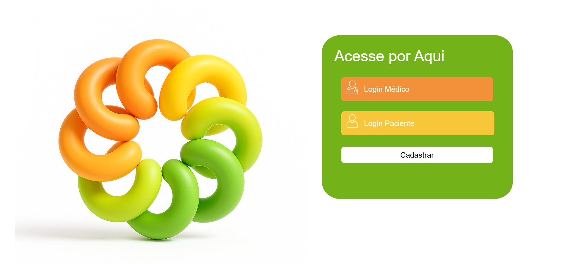

Autores
Alex Geymeson Lemos de Araujo - RA: 82519534

Arthur de Assis Matos - RA: 825141669

Kauann Dos Santos Silva - RA: 825141522

Paulo Barreiro - RA: 825161684

Victor Sousa de Carvalho - RA: 820266034

Vinicius Paiutti - RA: 824216626

Professor Orientador:
Tulio Cearamicoli Vivaldini

Sobre o Projeto

O Control Healthy é um sistema web desenvolvido para o monitoramento e gestão da pressão arterial de pacientes, com foco na disciplina de Programação de Soluções Computacionais. O projeto contribui para o Objetivo de Desenvolvimento Sustentável (ODS) 3 da ONU — Saúde e Bem-Estar — ao facilitar o acompanhamento de pacientes hipertensos por profissionais de saúde.

A hipertensão é uma condição crônica que exige acompanhamento contínuo, e a ausência de ferramentas adequadas pode dificultar a avaliação de tratamentos e a prevenção de complicações graves, como doenças cardíacas e acidentes vasculares cerebrais. O Control Healthy oferece uma solução robusta para que profissionais de saúde e pacientes possam registrar, visualizar e analisar dados de saúde de forma eficiente.

Contribuição para a Saúde (ODS 3)
O projeto está alinhado ao ODS 3 da ONU, contribuindo para:

Apoio à Gestão de Doenças Crônicas: Facilita o monitoramento contínuo da hipertensão.

Tomada de Decisão Baseada em Dados: Permite a geração de gráficos e exportação de dados para análise profissional.

Empoderamento e Educação do Paciente: A visualização gráfica auxilia o paciente na compreensão da própria condição e na adesão ao tratamento.

Melhoria da Qualidade de Vida: Auxilia na prevenção de complicações graves associadas à pressão alta.

Principais Funcionalidades
Autenticação de Usuários: Tela de login segura, com perfis diferenciados para pacientes e médicos.

Cadastro de Usuários: Permite o registro de pacientes e médicos.

Gerenciamento de Usuários (CRUD): Adição, listagem, edição e exclusão de usuários do sistema.

Registro de Pressão Arterial: Interface para registrar medições de pressão sistólica e diastólica, com limite de até 2 registros por dia por paciente.

Edição de Dados do Paciente: Possibilidade de editar informações como nome, telefone e endereço.

Associação Médico-Paciente: Médicos podem se associar a pacientes para acompanhamento.

Visualização de Lista de Pacientes: Médicos têm acesso à lista de pacientes associados.

Visualização de Histórico e Gráficos: Geração de gráficos de linha (diários, semanais e mensais) para análise da evolução da pressão arterial.

Geração de Relatórios em PDF: Relatórios completos do histórico e gráficos de pressão arterial.

Logout: Encerramento seguro da sessão do usuário.

Navegação Simplificada: Menu principal centralizando o acesso a todas as funcionalidades.

Stack Tecnológico
Backend: PHP 7.x ou superior

Banco de Dados: MySQL 5.x ou superior

Frontend: HTML, CSS, JavaScript (com Chart.js para gráficos)

Servidor Web: Apache recomendado

Bibliotecas: FPDF (para geração de PDFs), extensão GD do PHP (para manipulação de imagens)

Requisitos
PHP 7.x ou superior

MySQL 5.x ou superior

Servidor Web (Apache recomendado)

Extensão GD do PHP habilitada

Navegador moderno

Configuração do Ambiente
Banco de Dados:

Crie um banco chamado control_healthy.

Importe as tabelas necessárias: usuarios, medico_paciente, informacoes_paciente, registros_pressao.

Configuração do PHP:

Edite os arquivos php/conexao.php e php/db.php para ajustar usuário, senha e host do seu MySQL.

Permissões:

Garanta que o servidor web tenha permissão de leitura e escrita nas pastas necessárias (para geração de arquivos temporários de imagem/PDF).

Bibliotecas:

O projeto já inclui a biblioteca FPDF e fontes em php/fpdf.php e php/font/.

Como Executar
Clone ou baixe o projeto em seu servidor local.

Configure o banco de dados conforme as instruções acima.

Acesse via navegador a tela de cadastro (html_css/cadastro.html) para criar usuários.

Faça login como paciente ou médico para acessar as funcionalidades específicas.

Registre medições, edite dados, associe pacientes a médicos, visualize gráficos e gere PDFs conforme o perfil de acesso.

Observações
Limite de Registros: Cada paciente pode registrar até 2 medições de pressão por dia.

Segurança: O sistema utiliza sessões e validações para garantir que apenas usuários autenticados acessem seus respectivos recursos.

Geração de PDF: Os relatórios utilizam a biblioteca FPDF, incluindo gráficos exportados em PNG pelo Chart.js.

Associação Médico-Paciente: Apenas médicos autenticados podem associar pacientes, visualizar listas e acessar gráficos detalhados.

Estrutura Modular: O código está organizado por responsabilidade, facilitando a manutenção e expansão futura.

