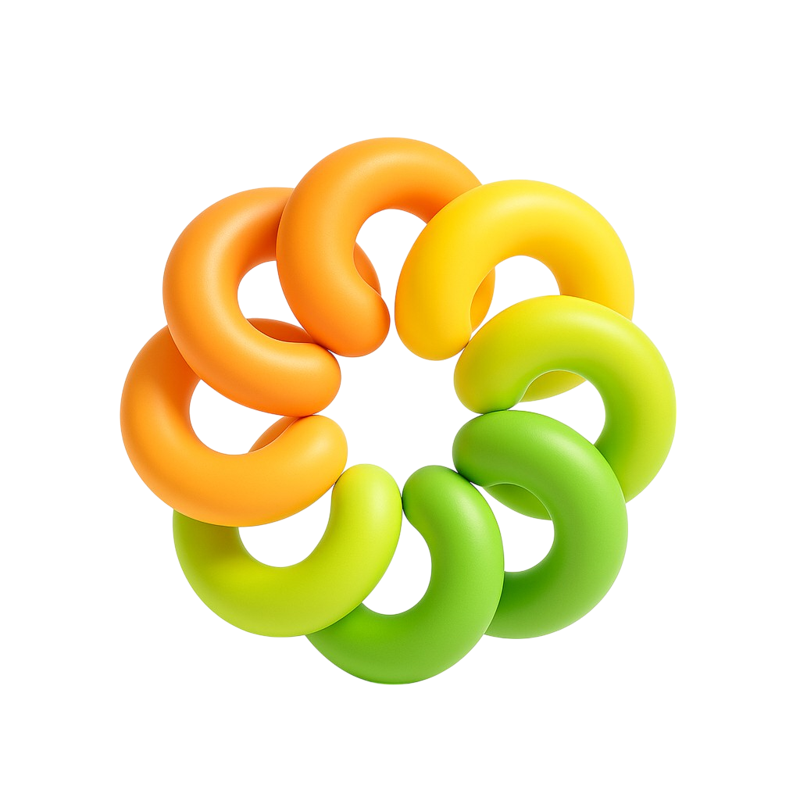
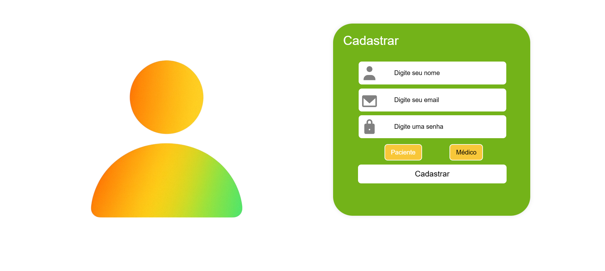
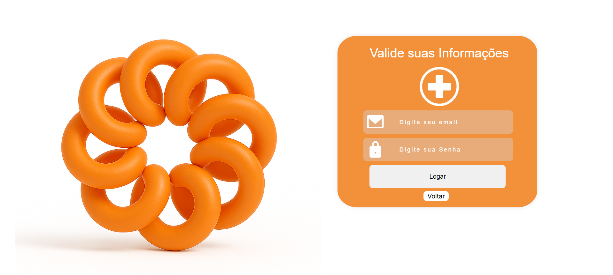
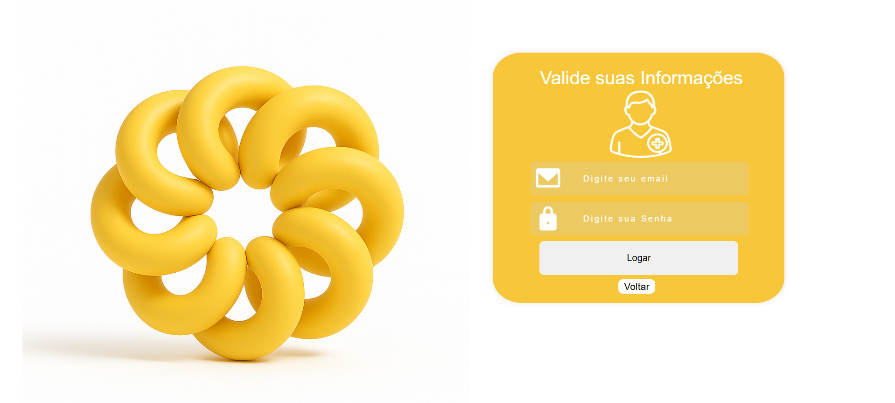
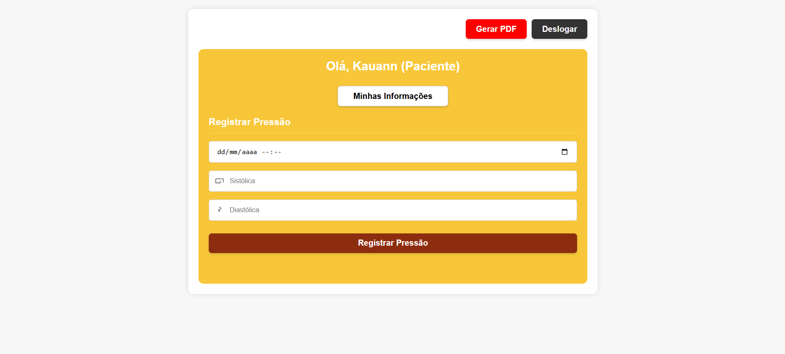
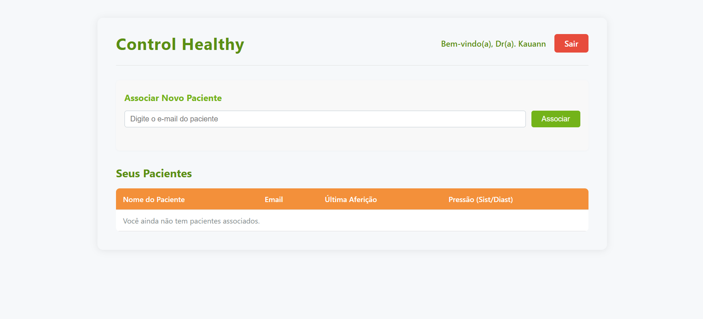

  
  <h1>🩺 Control Healthy</h1>
  <h3>Sistema de Monitoramento e Gestão de Pressão Arterial</h3>
  
  

    
    
    
    
  

 

## 📋 Sobre o Projeto
O **Control Healthy** é um sistema web desenvolvido para o monitoramento e a gestão da pressão arterial de pacientes. Este projeto foi criado no âmbito da disciplina de Programação de Soluções Computacionais.

A hipertensão é uma condição crônica que requer acompanhamento contínuo. A ausência de ferramentas adequadas pode dificultar a avaliação de tratamentos e a prevenção de complicações graves, como doenças cardíacas e acidentes vasculares cerebrais. A plataforma Control Healthy oferece uma solução robusta para que profissionais de saúde e pacientes possam registrar, visualizar e analisar dados de saúde de forma eficiente.

### 🎯 Contribuição para a Saúde (ODS 3)
O projeto está alinhado ao **Objetivo de Desenvolvimento Sustentável (ODS) 3 da ONU: Saúde e Bem-Estar**, contribuindo para:

* **Apoio à Gestão de Doenças Crônicas:** Facilita o monitoramento contínuo da hipertensão.
* **Tomada de Decisão Baseada em Dados:** Permite a geração de gráficos e a exportação de dados para análise profissional.
* **Empoderamento e Educação do Paciente:** A visualização gráfica auxilia o paciente na compreensão da sua condição e na adesão ao tratamento.
* **Melhoria da Qualidade de Vida:** Auxilia na prevenção de complicações graves associadas à pressão alta.

## 🛠️ Stack Tecnológico

* **Backend:** PHP 7.x ou superior
* **Banco de Dados:** MySQL 5.x ou superior
* **Frontend:** HTML, CSS, JavaScript (com Chart.js para gráficos)
* **Servidor Web:** Apache (recomendado)
* **Bibliotecas:** FPDF (para geração de PDFs), extensão GD do PHP (para manipulação de imagens)

## ✨ Funcionalidades Principais

O sistema oferece perfis distintos para pacientes e médicos com funcionalidades específicas:

* **Autenticação e Cadastro:** Telas de login e cadastro seguras para pacientes e médicos.
* **Gerenciamento de Usuários (CRUD):** Adição, listagem, edição e exclusão de usuários.
* **Registro de Pressão Arterial:** Interface para registrar medições sistólicas e diastólicas (limite de 2 registros/dia).
* **Edição de Dados:** Possibilidade de editar informações cadastrais (nome, telefone, endereço).
* **Associação Médico-Paciente:** Médicos podem se associar a pacientes para acompanhamento.
* **Histórico e Gráficos:** Gráficos de linha (diários, semanais e mensais) para evolução da pressão.
* **Relatórios:** Geração de relatórios completos em PDF do histórico.
* **Lista de Pacientes:** Médicos têm acesso à lista de pacientes associados e suas últimas medições.
* **Segurança:** Logout e encerramento seguro da sessão.

## 📸 Imagens do Projeto

| Tela para Novo Cadastro |
| :---: |
|  |

 

| Telas de Login (Médico e Paciente) |
| :---: |
|   |

 

| Tela Inicial do Paciente |
| :---: |
|  |

 

| Tela Inicial do Médico |
| :---: |
|  |

## 🚀 Como Executar

### Requisitos do Ambiente
* PHP 7.x ou superior
* MySQL 5.x ou superior
* Servidor Web (Apache recomendado)
* Extensão GD do PHP habilitada
* Navegador moderno

### Configuração e Instalação

1. **Banco de Dados:**
   * Crie um banco de dados chamado `control_healthy`.
   * Importe o arquivo `control_healthy.sql`.
   * *Nota: As tabelas `medico_paciente`, `informacoes_paciente`, e `registros_pressao` são criadas pelo sistema.*

2. **Configuração do PHP:**
   * Edite os arquivos `php/conexao.php` e `php/db.php`.
   * Ajuste o usuário, senha e host do seu MySQL.

3. **Permissões:**
   * Certifique-se de que o servidor web tenha permissão de leitura e escrita nas pastas necessárias para a geração de arquivos temporários.

4. **Execução:**
   * Clone ou baixe o projeto para o seu servidor local.
   * Acesse a tela de cadastro (`html_css/cadastro.html`) para criar os usuários.
   * Faça login como paciente ou médico.

## 📝 Observações Importantes
* **Limite de Registros:** Cada paciente pode registrar até 2 medições de pressão por dia.
* **Segurança:** O sistema utiliza sessões e validações para garantir que apenas usuários autenticados acessem seus recursos.
* **Associação:** Apenas médicos autenticados podem associar pacientes e visualizar gráficos detalhados.

## 🎓 Autores

* **[Alex Geymeson Lemos de Araujo](https://www.linkedin.com/in/alex-lemos-5b5b14361/)**
* **[Arthur de Assis Matos](https://www.linkedin.com/in/arthur-matos-108713295/)**
* **[Kauann Dos Santos Silva](https://www.linkedin.com/in/kauann-santos-931740242/)**
* **[Paulo Barreiro](https://www.linkedin.com/in/paulobarreiro96/)** 
* **[Victor Sousa de Carvalho](https://www.linkedin.com/in/victor-sousa-933138128/)** 
* **[Vinicius Paiutti](https://www.linkedin.com/in/vinicius-paiutti/)** 

**Professor Orientador:** Tulio Cearamicoli Vivaldini
