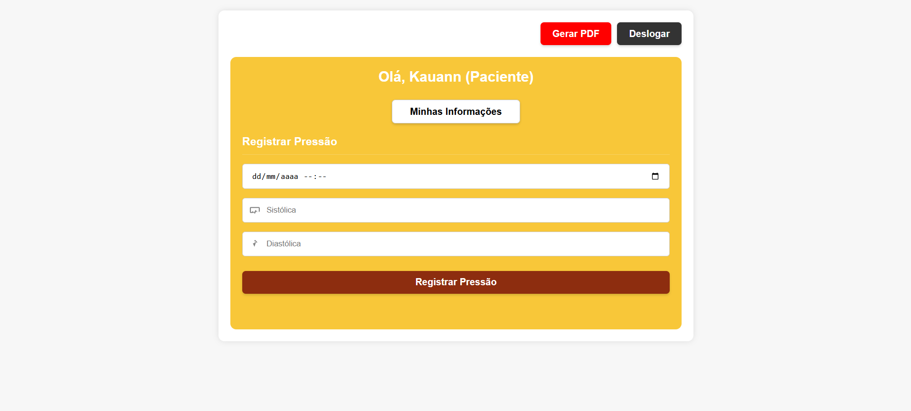

# Control Healthy

O Control Healthy é um sistema web desenvolvido para o monitoramento e a gestão da pressão arterial de pacientes. Este projeto foi criado no âmbito da disciplina de Programação de Soluções Computacionais, com o objetivo de contribuir para o **Objetivo de Desenvolvimento Sustentável (ODS) 3 da ONU: Saúde e Bem-Estar**.

A hipertensão é uma condição crônica que requer acompanhamento contínuo. A ausência de ferramentas adequadas pode dificultar a avaliação de tratamentos e a prevenção de complicações graves, como doenças cardíacas e acidentes vasculares cerebrais. A plataforma Control Healthy oferece uma solução robusta para que profissionais de saúde e pacientes possam registrar, visualizar e analisar dados de saúde de forma eficiente.

## Autores

* Alex Geymeson Lemos de Araujo - RA: 82519534
* Arthur de Assis Matos - RA: 825141669
* Kauann Dos Santos Silva - RA: 825141522
* Paulo Barreiro - RA: 825161684
* Victor Sousa de Carvalho - RA: 820266034
* Vinicius Paiutti - RA: 824216626

**Professor Orientador:** Tulio Cearamicoli Vivaldini

---

## Contribuição para a Saúde (ODS 3)

O projeto está alinhado ao ODS 3 da ONU, contribuindo para:

* **Apoio à Gestão de Doenças Crônicas:** Facilita o monitoramento contínuo da hipertensão.
* **Tomada de Decisão Baseada em Dados:** Permite a geração de gráficos e a exportação de dados para análise profissional.
* **Empoderamento e Educação do Paciente:** A visualização gráfica auxilia o paciente na compreensão da sua condição e na adesão ao tratamento.
* **Melhoria da Qualidade de Vida:** Auxilia na prevenção de complicações graves associadas à pressão alta.

---

## Funcionalidades Principais

O sistema oferece perfis distintos para pacientes e médicos com funcionalidades específicas:

* **Autenticação e Cadastro de Usuários:** Telas de login e cadastro seguras para pacientes e médicos.
* **Gerenciamento de Usuários (CRUD):** Adição, listagem, edição e exclusão de usuários.
* **Registro de Pressão Arterial:** Interface para o paciente registrar medições de pressão sistólica e diastólica, com limite de até 2 registros por dia.
* **Edição de Dados do Paciente:** Possibilidade de editar informações como nome, telefone e endereço.
* **Associação Médico-Paciente:** Médicos podem se associar a pacientes para acompanhamento.
* **Visualização de Histórico e Gráficos:** Geração de gráficos de linha (diários, semanais e mensais) para a evolução da pressão arterial.
* **Geração de Relatórios em PDF:** Relatórios completos do histórico e gráficos de pressão arterial.
* **Visualização da Lista de Pacientes:** Médicos têm acesso à lista de pacientes associados e suas últimas medições.
* **Logout:** Encerramento seguro da sessão.

## Imagens do Projeto

* **Tela para Novo Cadastro:** 
* **Tela de Validação das Credenciais (Médico):** 
* **Tela de Validação das Credenciais (Paciente):** 
* **Tela Inicial do Paciente:** 
* **Tela Inicial do Médico:** 

---

## Stack Tecnológico

* **Backend:** PHP 7.x ou superior
* **Banco de Dados:** MySQL 5.x ou superior
* **Frontend:** HTML, CSS, JavaScript (com Chart.js para gráficos)
* **Servidor Web:** Apache (recomendado)
* **Bibliotecas:** FPDF (para geração de PDFs), extensão GD do PHP (para manipulação de imagens)

## Requisitos do Ambiente

* PHP 7.x ou superior
* MySQL 5.x ou superior
* Servidor Web (Apache recomendado)
* Extensão GD do PHP habilitada
* Navegador moderno

## Configuração do Ambiente

1.  **Banco de Dados:**
    * Crie um banco de dados chamado `control_healthy`.
    * Importe o arquivo `control_healthy.sql`.
    * As tabelas `medico_paciente`, `informacoes_paciente`, e `registros_pressao` são criadas pelo sistema.

2.  **Configuração do PHP:**
    * Edite os arquivos `php/conexao.php` e `php/db.php` para ajustar o usuário, senha e host do seu MySQL.

3.  **Permissões:**
    * Certifique-se de que o servidor web tenha permissão de leitura e escrita nas pastas necessárias para a geração de arquivos temporários de imagem e PDF.

## Como Executar

1.  Clone ou baixe o projeto para o seu servidor local.
2.  Configure o banco de dados conforme as instruções acima.
3.  Acesse a tela de cadastro (`html_css/cadastro.html`) para criar os usuários.
4.  Faça login como paciente ou médico para acessar as funcionalidades específicas do seu perfil.
5.  Utilize a plataforma para registrar medições, editar dados, associar pacientes, visualizar gráficos e gerar PDFs.

---

## Observações

* **Limite de Registros:** Cada paciente pode registrar até 2 medições de pressão por dia.
* **Segurança:** O sistema utiliza sessões e validações para garantir que apenas usuários autenticados acessem seus respectivos recursos.
* **Associação Médico-Paciente:** Apenas médicos autenticados podem associar pacientes, visualizar listas e acessar gráficos detalhados.
